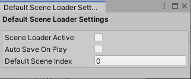

# Default Scene Loader
This little utility provides the user with the ability to select a default loading scene whenever the play button is pressed. Perfect for games with preloader scenes that are required to run before launching the actual game.

<b>Setup Instructions</b>
<ul>
  <li>Insert the contents of the Default Scene Loader folder into your project's Editor folder</li>
  <li>Navigate to your Toolbar at the top of the Unity Editor and select Comp-3 Utils > Default Scene Loader Settings</li>
  <li>Here are a few customisation settings:</li>
  <ul>
    <li><b>Scene Loader Active</b> - This is whether or not the module will run when pressing the play button. If left unchecked then the editor will run as normal. Checking this box will force the editor to load the specified scene using it's index whenever the play button is pressed. Default scene index is 0.</li>
    <li><b>Auto Save On Play</b> - This will bypass the "Would you like to save open scenes" prompt which is displayed when swapping scenes from a dirty scene. Left unchecked, the user will be prompted to save the open scene(s) or not.</li>
    <li><b>Default Scene Index</b> - Self-explanitory really, this is the scene index of the scene you wish to load whenever the play button is pressed.</li>
  </ul>
</ul>

<u>Hope this comes in handy for you guys!</u>
